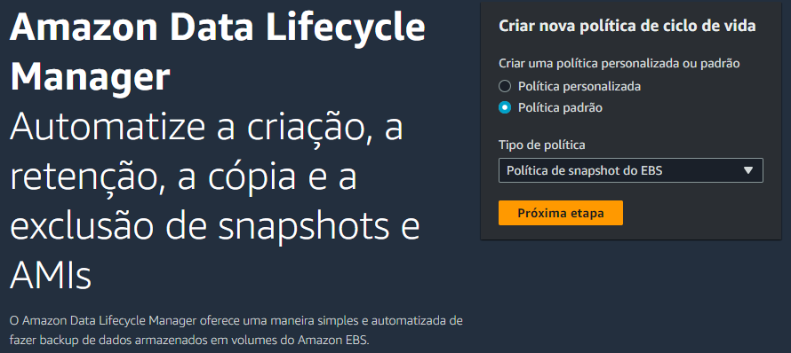
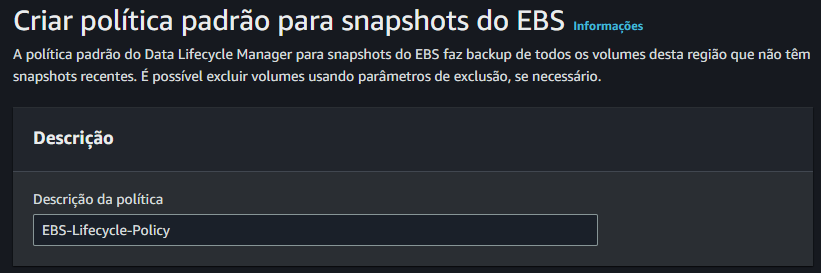
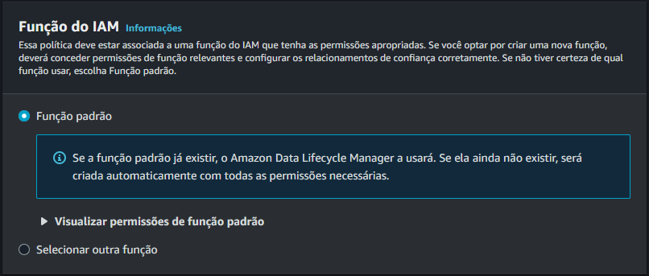
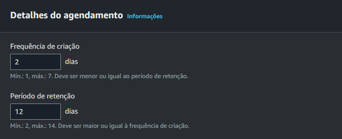
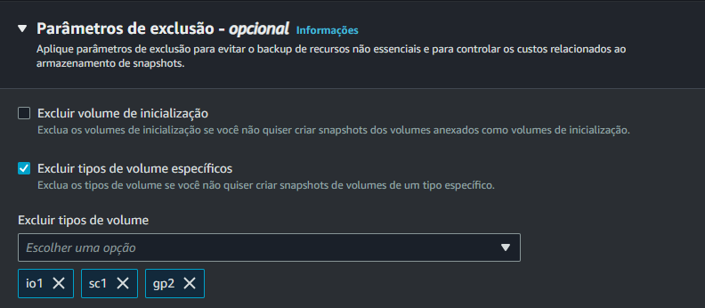
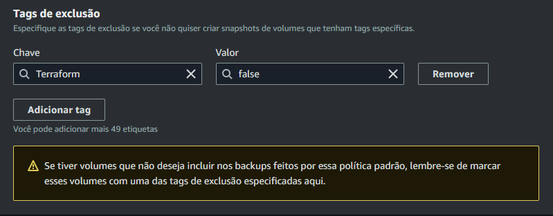
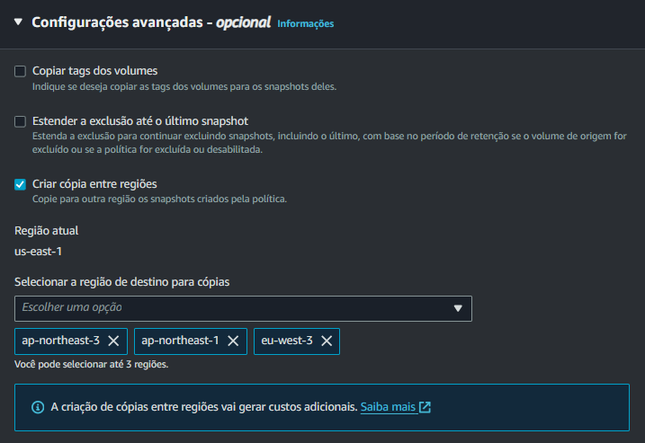
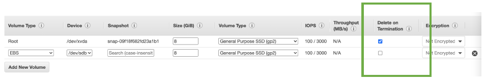
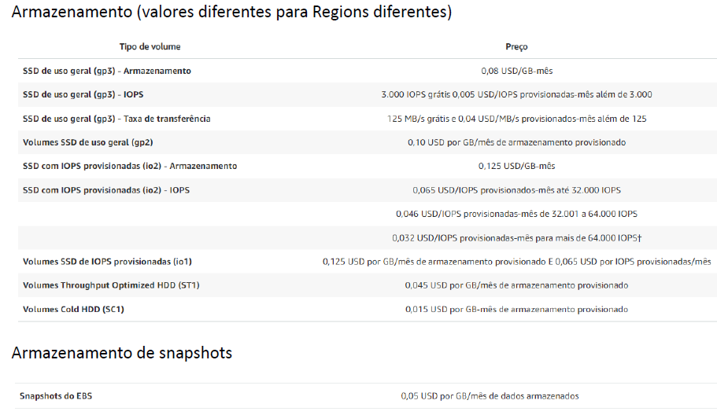

# Elastic Block Storage (EBS)

Serviço de armazenamento em blocos para instâncias EC2.

---

### 1. Introdução

Os volumes EBS persistem independentemente da vida útil da instância. O EBS é recomendado para dados que devem ser rapidamente acessíveis e requerem persistência de longo prazo.

É um drive de rede (não é um storage físico da instância). Utiliza a rede AWS para se comunicar com a instância, o que significa que pode haver um pouco de latência na conexão.

Um Volume pode ser criado e não ser attachado a nenhuma instância.

Uma instância pode ter vários volumes montados a ela.

Um volume pode estar montado em apenas uma instância por vez (Exceções para **multi-attach volumes**).


Seu escopo de atuação é local, dentro de uma AZ. Para atachar o volume a instância, ambos precisa estar na mesma zona de disponibilidade. Para mover um volume entre AZs, é preciso primeiro criar um **snapshot**.

---

### 2. Tipos de Volumes

**SSD de uso geral (gp2 e gp3):**

Equilíbrio entre preço e performance. Ideal para Bancos de Dados, ambientes de Dev e Testes.

**SSD de IOPs Provisionadas (io1 e io2):**

Para uso intensivo de E/S, você define o IOPs.

**HDD Otimizados para Taxa de Transferência (st1):**

Armazenamento Magnético de baixo custo. Ideal para workloads grandes e sequenciais como EMR, ETL, Data Warehouses e Processamento de Logs.

**HDD (sc1):**

Armazenamento Magnético de baixo custo (o mais barato) para acesso infrequente a dados.

**Comparação entre volumes SSD**


**Comparação entre volumes HDD**


---

### 3. Criptografia

Você pode criar volumes EBS criptografados. Quando você anexa um volume criptografado a uma instância, os dados armazenados em repouso no volume, E/S de disco e snapshots criados do volume são todos criptografados.

Não é possível habilitar criptografia em um volume que foi criado com criptografia desabilitada. Para criptografar os dados de um volume existe, é preciso:

* Criar um snapshot do volume atual descriptografado;
* Restaurar um volume a partir do snapshot habilitando a criptografia;
* Substituir o disco antigo pelo novo criptografado.

---

### 4. Snapshots

Snapshots são backups dos volumes que são salvos no S3 (onde é armazenado em pelo menos 3 AZs). O volume não precisa estar anexado a uma instância para ter um snapshot.

Snapshots de volumes criptografados são automaticamente criptografados.

Os snapshots podem ser compartilhados com contas específicas da AWS ou serem públicos.

Snapshots são backups incrementais, o que significa que serão salvos somente os blocos no volume que mudaram depois do snapshot mais recente.

Se você tiver um volume com 100 GB de dados, mas somente 5 GB de dados tiverem mudadao desde seu último snapshot, somente os 5 GB de dados modificados serão gravados no snapshot.

Mesmo que os snapshots sejam salvos de forma incremental, o processo de exclusão de snapshots foi projetado de forma que você precise manter somente o snapshot mais recente.

Snapshot faz backup apenas dos dados armazenados. Se você tem um volume de 30 GB com 8 GB de espaço utilizado, o snapshot gravará apenas os 8 GB.

Você pode criar um snapshot caso queira alterar o tipo de disco, é só restaurar um volume a partir do snapshot.

Backups do EBS usam uma parte do I/O provisionado. Não faça backups em horários de trabalho.

É possível agendar a criação de snapshots na console (diários, semanais, mensais, anuais e customizados) para automatizar a criação de snapshots (somente dos volumes ou de volumes + instâncias).

Para diminuir a capacidade de um disco (no caso de você te-lo superdimensionado) você pode criar um snapshot do volume atual e restaurá-lo em um volume de tamanho menor. É possível apenas aumentar o tamanho de um volume existente, diminuir não, por isso é preciso usar restauração a partir de snapshots.

Ao excluir um snapshot, somente os dados excluídos desse snapshot serão removidos.

**Exemplo de snapshots incrementais**


- No **State 1**, o primeiro snapshot é tirado, com isso, **SNAP A** ocupa 10 GB (no S3);

- No **State 2**, 4 GB de dados são modificados no volume, que continua com 10 GB, já que dados novos não foram inseridos, só modificados. Dessa forma, o **SNAP B** que é tirado contém **apenas os 4 GB de dados alterados**. OS 6 GB de dados que não foram modificados são referenciados no SNAP A. Nesse instante, temos no S3 Bucket 10 GB do SNAP A + 4 GB do SNAP B = 14 GB;

- No **State 3**, o volume recebe 2 GB de dados novos, aumentando o tamanho de 10 GB para 12 GB. O **SNAP C** contém apenas os 2 GB de dados novos e faz referência para o SNAP B (4 GB de dados modificados) e para o SNAP A (6 GB de dados sem modificação). Nesse instante, temos 10 GB (SNAP A) + 4 GB (SNAP B) + 2 GB (SNAP C) = 16 GB armazenados no S3. Perceba que o volume de dados de snapshot armazenados (16 GB) é maior que o volume de dados no disco EBS (6 + 4 + 2 = 12 GB).

**Exemplo de exclusão de snapshots**


- **State 1**: SNAP A é criado com 10 GB de dados, que são todos os dados do volume, já que se trata do primeiro snapshot, por isso a cópia é full;

- **State 2**: SNAP B contém alteração de 4 GB de dados e os 6 GB de dados inalterados não são replicados, somente referenciados pelo SNAP B. Nesse instante há 14 GB de dados no S3;

- **State 3**: O SNAP A é excluído. O que ocorre, é que os 6 GB de dados que eram apenas referenciados, foram movidos para o SNAP B. Dessa forma, agora há 10 GB de dados armazenados no S3, o que muda é que você não possui mais a "versão original" dos 4 GB de dados modificados no State 2.

---

### 5. Amazon Data Lifecycle Manager

Te permite automatizar a criação, retenção, cópia e exclusão de snapshots e AMIs.



Primeiro, é preciso dar uma descrição a sua política de ciclo de vida.



Depois, você precisa selecionar uma Role do IAM para utilizar.



A role padrão vem com as seguintes permissões:

```json
{
	"Version": "2012-10-17",
	"Statement": [
		{
			"Effect": "Allow",
			"Action": [
				"ec2:CreateSnapshot",
				"ec2:CreateSnapshots",
				"ec2:DeleteSnapshot",
				"ec2:DescribeInstances",
				"ec2:DescribeVolumes",
				"ec2:DescribeSnapshots",
				"ec2:EnableFastSnapshotRestores",
				"ec2:DescribeFastSnapshotRestores",
				"ec2:DisableFastSnapshotRestores",
				"ec2:CopySnapshot",
				"ec2:ModifySnapshotAttribute",
				"ec2:DescribeSnapshotAttribute",
				"ec2:DescribeSnapshotTierStatus",
				"ec2:ModifySnapshotTier"
			],
			"Resource": "*"
		},
		{
			"Effect": "Allow",
			"Action": [
				"ec2:CreateTags"
			],
			"Resource": "arn:aws:ec2:*::snapshot/*"
		},
		{
			"Effect": "Allow",
			"Action": [
				"ec2:CreateTags",
				"events:PutRule",
				"events:DeleteRule",
				"events:DescribeRule",
				"events:EnableRule",
				"events:DisableRule",
				"events:ListTargetsByRule",
				"events:PutTargets",
				"events:RemoveTargets"
			],
			"Resource": "arn:aws:events:*:*:rule/AwsDataLifecycleRule.managed-cwe.*"
		}
	]
}
```

Em seguida, você precisa informar os detalhes do agendamento, informando a frequência com que os snapshots serão criados e por quanto tempo serão retidos.



Em parâmetros de exclusão você pode informar volumes de inicialização ou volumes de tipos específicos (como `io2`, `sc1`, `gp2`, etc) para não incluílos nas rotinas de backup (como se fosse um .gitignore).



Também é possível excluir volumes utilizando tags.
No exemplo abaixo, qualquer volume que tiver a tag `Terraform=false` não terá seu backup feito.



Em configurações avançadas, é possível:

* Copiar as tags dos volumes;
* Estender a exclusão até o último snapshot;
* Criar cópias entre regiões.



---

### 6. Outras informações

* Alguns tipos de volumes (io1 ou io2) suportam o recurso **Multi-Attach**, o que permite anexar o mesmo volume a várias instâncias EC2 na mesma AZ. Cada instância à qual o volume está anexado tem permissão completa de leitura e escrita no volume compartilhado, entretando, o volume só pode ser anexado a até 16 instâncias Linux criadas no **Sistema Nitro** (coleção de hardware e componentes de software criados pela AWS que permitem alta performance, alta disponibilidade e alta segurança);

* Amazon EC2 permite substituir o volume raiz do EBS para uma instância em execução sem terminá-la. A instância é reiniciada automaticamente quando o volume raiz é substituído e o conteúdo da RAM é apagado durante a reinicialização. Não é possível substituir o volume raiz se a instância for **Instance Store Backed**;

* É possível configurar o **Delete on Termination** para que ao terminar a instância, o volume também seja apagado. Por default, o volume raiz da instância vem com esse atributo marcado e os volumes adicionais não.



* EBS Elastic Volumes: é possível modificar seu volume sem fazer o detach do volume ou restartar a instância. Você consegue aumentar o tamanho do volume (somente aumentar, não consegue diminuir), alterar o volume type para um tipo mais potente (`gp2` -> `gp3`), aumentar IOPs ou Throughput.

---

### 7. Custos



