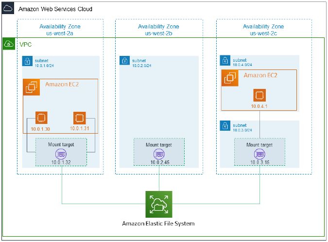
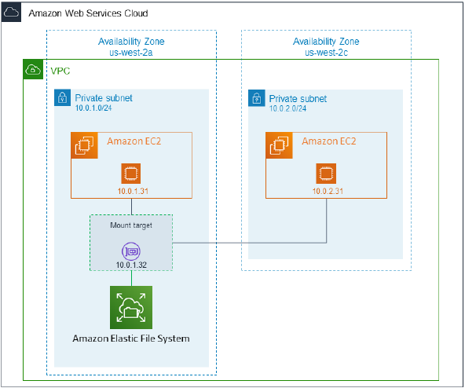
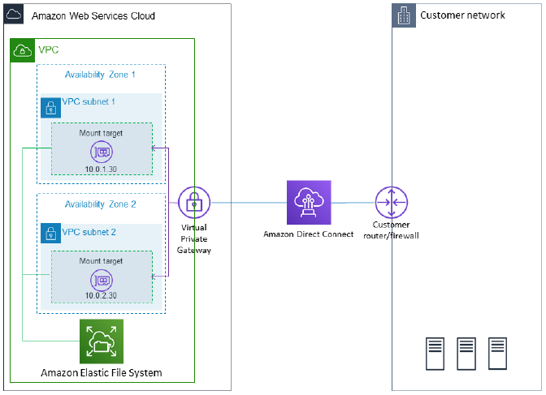

# Elastic File Systema (EFS)

Oferece um sistema de arquivos elástico simples e sem servidor. Escala sob demanda até petabytes sem interromper os aplicativos, aumentando e diminuindo automaticamente à medida que você adiciona e remove arquivos.

Compatível com o protocolo Network File System versão 4 (NFSv4.1 e 4.0). Pode ser acessado por EC2, ECS e Lambda e oferece um sistema de acesso simultâneo a dados para esses serviços de computação.

É compatível com Multi-AZ, tem alta disponibilidade, escalabilidade e é caro (custa 3x o preço de um EBS gp2).

**Casos de uso**: gestão de conteúdo, web serving, data sharing, Wordpress.

Utiliza `security groups` para controlar o acesso ao EFS e políticas do IAM.

Criptografia em repouso usando KMS.

É compatível apenas com Linux, por utilizar o POSIX file system, que tem uma API padronizada.

---

### 1. Performance

Escala do EFS:

* Milhares de clientes NFS simultâneos, 10 GB+/s throughput;
* Aumenta para escala de Petabytes automaticamente.

Performance Mode (configurado no momento de criação do EFS):

* **General Purpose (default)** - para casos sensíveis a latência (web server, CMS, etc);
* **Max I/O** - alta latência, throughput e paralelismo (big data, media processing).

Throughput Mode:

* **Bursting** - 1 TB = 50 MiB/s + burst de até 100 MiB/s;
* **Provisioned** - configura o seu throughput com base no tamanho do storage (ex.: 1 GiB/s para 1 TB de storaga);
* **Elastic** - faz scale up e down automático baseado nos workloads. Ideal para workloads imprevisíveis.

---

### 2. Storage Classes

* **Standart**: EFS Standart e EFS Standart - IA, que oferencem resiliência Multi-AZ (mais caro);

* **One Zone**: EFS One Zone e EFS One Zone - IA, que é mais econômica, mas utiliza só uma AZ (menos resiliente).

Com EFS é possível configurar lifecycle management (lifecycle policy), para mover os arquivos após N dias.

> Obs.: As classes Standart IA e One Zone IA aplicam taxas de recuperação de arquivos (retrieve).

* **EFS Intelligent-Tiering**: possui o mesmo conceito do S3 Intelligent Tiering. Move os objetos automaticamente entre as classes de armazenamento com base no padrão de acesso.

---

### 3. Exemplos

**Exemplo de configuração Standart:**

Para acessar seu NFS do EFS em uma VPC, é preciso criar um ou mais destinos de montagem na VPC.

* Para sistemas de arquivos que usam classes de armazenamento Standart, você pode criar um destino de montagem em cada AZ na Region;
* Para sistemas de arquivos que usam classes One Zone, você cria apenas um único destino de montagem que esteja na mesma AZ de disponibilidade do EFS.

> Um **destino de montagem (mount target)** oferece um endereço IP para um endpoint do NFSv4 no qual é possível montar um sistema de arquivos.

**Exemplo de configuração One Zone:**

Nesse caso, além da menor disponibilidade do EFS, há custos adicionais envolvidos na trasnferência de dados que saem/ entram na instância da zona 2c. Dados transferidos entre instâncias na mesma AZ não são cobrados.

**Exemplo de acesso local do EFS usando Direct Connect**

Dessa forma, é possível acessar o sistema de arquivos a partir da sua empresa, via Direct Connect.
