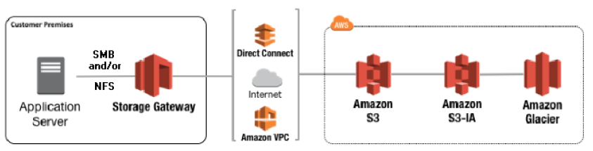
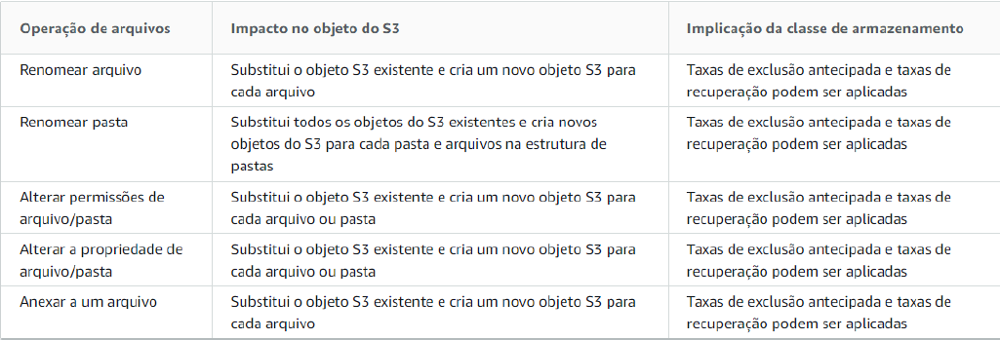

# Storage Gateway

Conecta um dispositivo de software local (tipo uma VM) a um armazenamento em nuvem para oferecer integração entre um ambiente de TI local e infraestrutura AWS (serviço de cloud híbrida).

---

### S3 File Gateway

Para usar o S3 File Gateway, você primeiro faz o download de uma imagem da VM para o gateway. Em seguida, você ativa o gateway a partir da Console por meio da Storage Gateway API. Também é possível criar um S3 File Gateway usando uma imagem do EC2.

Depois que o S3 File Gateway for ativado, crie e configure o compartilhamento de arquivos e associe-o ao bucket S3 de destino. Isso torna o compartilhamento acessível para clientes usando o protocolo NFS ou SMB (Server Message Block).

A atualização é feita de forma assíncrona no bucket à medida que os arquivos são alterados. A transferência é otimizada entre o gateway e a aws porque o serviço usa multipart upload.

Como os arquivos são convertidos em objetos no S3, é preciso tomar extremo cuidado com algumas operações nos arquivos no gateway:

---

### Tape Gateway

Um Gateway de fita que fornece armazenamento em fita virtual. É implantado da mesma forma que o File Gateway como uma VM no ambiente local.

Com Tape Gateway você pode arquivar de forma econômica e permanente os dados de backups no S3 Glacier Flexible Retrival ou no S3 Glacier Deep Archive.

---

### Volume Gateway

Fornece volumes de armazenamento de backup em nuvem que podem ser montados como dispositivos **Internet Small Computer System Interface (iSCSI)** em seus servidores de aplicativos locais.

---

### Cobrança

Com Storage Gateway, você é cobrado pelo armazenamento e pelas requisições no serviço target envolvido (S3, Glacier).